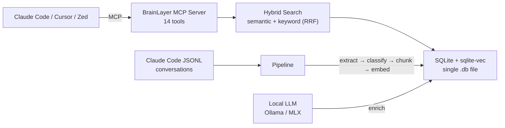

# BrainLayer

> Persistent memory for AI agents. Search, think, recall — across every conversation you've ever had.

[](LICENSE)
[](https://www.python.org/downloads/)
[](https://modelcontextprotocol.io)
[](#testing)

---

**Your AI agent forgets everything between sessions.** Every architecture decision, every debugging session, every preference you've expressed — gone. You repeat yourself constantly.

BrainLayer fixes this. It's a **local-first memory layer** that gives any MCP-compatible AI agent the ability to remember, think, and recall across conversations.

```
"What approach did I use for auth last month?"     →  brainlayer_think
"Show me everything about this file's history"     →  brainlayer_recall
"What was I working on yesterday?"                 →  brainlayer_current_context
"Remember this decision for later"                 →  brainlayer_store
```

## Quick Start

```bash
pip install brainlayer
brainlayer init              # Interactive setup wizard
brainlayer index             # Index your Claude Code conversations
```

Then add to your editor's MCP config:

**Claude Code** (`~/.claude.json`):
```json
{
  "mcpServers": {
    "brainlayer": {
      "command": "brainlayer-mcp"
    }
  }
}
```

<details>
<summary>Other editors (Cursor, Zed, VS Code)</summary>

**Cursor** (MCP settings):
```json
{
  "mcpServers": {
    "brainlayer": {
      "command": "brainlayer-mcp"
    }
  }
}
```

**Zed** (`settings.json`):
```json
{
  "context_servers": {
    "brainlayer": {
      "command": { "path": "brainlayer-mcp" }
    }
  }
}
```

**VS Code** (`.vscode/mcp.json`):
```json
{
  "servers": {
    "brainlayer": {
      "command": "brainlayer-mcp"
    }
  }
}
```

</details>

That's it. Your agent now has persistent memory across every conversation.

## Architecture



**Everything runs locally.** No cloud accounts, no API keys, no Docker, no database servers.

| Component | Implementation |
|-----------|---------------|
| Storage | SQLite + [sqlite-vec](https://github.com/asg017/sqlite-vec) (single `.db` file, WAL mode) |
| Embeddings | `bge-large-en-v1.5` via sentence-transformers (1024 dims, runs on CPU/MPS) |
| Search | Hybrid: vector similarity + FTS5 keyword, merged with Reciprocal Rank Fusion |
| Enrichment | Local LLM via Ollama or MLX — 10-field metadata per chunk |
| MCP Server | stdio-based, MCP SDK v1.26+, compatible with any MCP client |
| Clustering | HDBSCAN + UMAP for brain graph visualization (optional) |

## MCP Tools (14)

### Intelligence Layer

| Tool | Description |
|------|-------------|
| `brainlayer_think` | Given your current task context, retrieves relevant decisions, patterns, and bugs. Groups by intent. |
| `brainlayer_recall` | File-based or topic-based recall. "What happened with this file?" or "What do I know about deployment?" |
| `brainlayer_current_context` | Lightweight — recent projects, branches, files, and active plan. No embedding needed. |
| `brainlayer_sessions` | Browse recent sessions by project and date range. |
| `brainlayer_session_summary` | Session-level analysis: decisions made, corrections, learnings, quality scores. |
| `brainlayer_store` | Persist a memory (idea, decision, learning, mistake, etc.) for future retrieval. |

### Search & Context

| Tool | Description |
|------|-------------|
| `brainlayer_search` | Hybrid semantic + keyword search with filters (project, type, source, tag, intent, importance, date range). |
| `brainlayer_context` | Surrounding conversation chunks for a search result. |
| `brainlayer_file_timeline` | Full interaction history of a file across all sessions. |
| `brainlayer_operations` | Logical operation groups — read/edit/test cycles within a session. |
| `brainlayer_regression` | What changed since a file last worked? Diff-based regression analysis. |
| `brainlayer_plan_links` | Connect sessions to implementation plans and phases. |
| `brainlayer_stats` | Knowledge base statistics (chunks, projects, content types). |
| `brainlayer_list_projects` | List all indexed projects. |

## Enrichment

BrainLayer enriches each chunk with 10 structured metadata fields using a local LLM:

| Field | Example |
|-------|---------|
| `summary` | "Debugging Telegram bot message drops under load" |
| `tags` | "telegram, debugging, performance" |
| `importance` | 8 (architectural decision) vs 2 (directory listing) |
| `intent` | `debugging`, `designing`, `implementing`, `configuring`, `deciding`, `reviewing` |
| `primary_symbols` | "TelegramBot, handleMessage, grammy" |
| `resolved_query` | "How does the Telegram bot handle rate limiting?" |
| `epistemic_level` | `hypothesis`, `substantiated`, `validated` |
| `version_scope` | "grammy 1.32, Node 22" |
| `debt_impact` | `introduction`, `resolution`, `none` |
| `external_deps` | "grammy, Supabase, Railway" |

Two local LLM backends:

| Backend | Best for | Speed |
|---------|----------|-------|
| **MLX** (Apple Silicon) | M1/M2/M3 Macs | 21-87% faster than Ollama |
| **Ollama** | Any platform | ~1s/chunk (short), ~13s (long) |

```bash
brainlayer enrich                              # Default backend (auto-detects)
BRAINLAYER_ENRICH_BACKEND=mlx brainlayer enrich --batch-size=100
```

## Why BrainLayer?

| | BrainLayer | Mem0 | Zep/Graphiti | Letta | LangChain Memory |
|---|:---:|:---:|:---:|:---:|:---:|
| **MCP native** | 14 tools | 1 server | 1 server | No | No |
| **Think / Recall** | Yes | No | No | No | No |
| **Local-first** | SQLite | Cloud-first | Cloud-only | Docker+PG | Framework |
| **Zero infra** | `pip install` | API key | API key | Docker | Multiple deps |
| **Multi-source** | 6 sources | API only | API only | API only | API only |
| **Enrichment** | 10 fields | Basic | Temporal | Self-write | None |
| **Session analysis** | Yes | No | No | No | No |
| **Open source** | Apache 2.0 | Apache 2.0 | Source-available | Apache 2.0 | MIT |

BrainLayer is the only memory layer that:
1. **Thinks before answering** — categorizes past knowledge by intent (decisions, bugs, patterns) instead of raw search results
2. **Runs on a single file** — no database servers, no Docker, no cloud accounts
3. **Works with every MCP client** — 14 tools, instant integration, zero SDK

## CLI Reference

```bash
brainlayer init               # Interactive setup wizard
brainlayer index              # Index new conversations
brainlayer search "query"     # Semantic + keyword search
brainlayer enrich             # Run LLM enrichment on new chunks
brainlayer enrich-sessions    # Session-level analysis (decisions, learnings)
brainlayer stats              # Database statistics
brainlayer brain-export       # Generate brain graph JSON
brainlayer export-obsidian    # Export to Obsidian vault
brainlayer dashboard          # Interactive TUI dashboard
```

## Configuration

All configuration is via environment variables:

| Variable | Default | Description |
|----------|---------|-------------|
| `BRAINLAYER_DB` | `~/.local/share/brainlayer/brainlayer.db` | Database file path |
| `BRAINLAYER_ENRICH_BACKEND` | auto-detect (MLX on Apple Silicon, else Ollama) | Enrichment LLM backend |
| `BRAINLAYER_ENRICH_MODEL` | `glm-4.7-flash` | Ollama model name |
| `BRAINLAYER_MLX_MODEL` | `mlx-community/Qwen2.5-Coder-14B-Instruct-4bit` | MLX model identifier |
| `BRAINLAYER_OLLAMA_URL` | `http://127.0.0.1:11434/api/generate` | Ollama API endpoint |
| `BRAINLAYER_MLX_URL` | `http://127.0.0.1:8080/v1/chat/completions` | MLX server endpoint |
| `BRAINLAYER_STALL_TIMEOUT` | `300` | Seconds before killing a stuck enrichment chunk |
| `BRAINLAYER_HEARTBEAT_INTERVAL` | `25` | Log progress every N chunks during enrichment |
| `BRAINLAYER_SANITIZE_EXTRA_NAMES` | (empty) | Comma-separated names to redact from indexed content |
| `BRAINLAYER_SANITIZE_USE_SPACY` | `true` | Use spaCy NER for PII detection |

## Optional Extras

```bash
pip install "brainlayer[brain]"     # Brain graph visualization (HDBSCAN + UMAP)
pip install "brainlayer[cloud]"     # Cloud backfill (Gemini Batch API)
pip install "brainlayer[youtube]"   # YouTube transcript indexing
pip install "brainlayer[ast]"       # AST-aware code chunking (tree-sitter)
pip install "brainlayer[dev]"       # Development: pytest, ruff
```

## Data Sources

BrainLayer can index conversations from multiple sources:

| Source | Format | Indexer |
|--------|--------|---------|
| Claude Code | JSONL (`~/.claude/projects/`) | `brainlayer index` |
| Claude Desktop | JSON export | `brainlayer index --source desktop` |
| WhatsApp | Exported `.txt` chat | `brainlayer index --source whatsapp` |
| YouTube | Transcripts via yt-dlp | `brainlayer index --source youtube` |
| Markdown | Any `.md` files | `brainlayer index --source markdown` |
| Manual | Via MCP tool | `brainlayer_store` |

## Testing

```bash
pip install -e ".[dev]"
pytest tests/                           # Full suite (268 tests)
pytest tests/ -m "not integration"      # Unit tests only (fast)
ruff check src/                         # Linting
```

## Contributing

Contributions welcome! See [CONTRIBUTING.md](CONTRIBUTING.md) for dev setup, testing, and PR guidelines.

## License

Apache 2.0 — see [LICENSE](LICENSE).

## Origin

BrainLayer was originally developed as "Zikaron" (Hebrew: memory) inside a personal AI agent ecosystem. It was extracted into a standalone project because **every developer deserves persistent AI memory** — not just the ones building their own agent systems.
