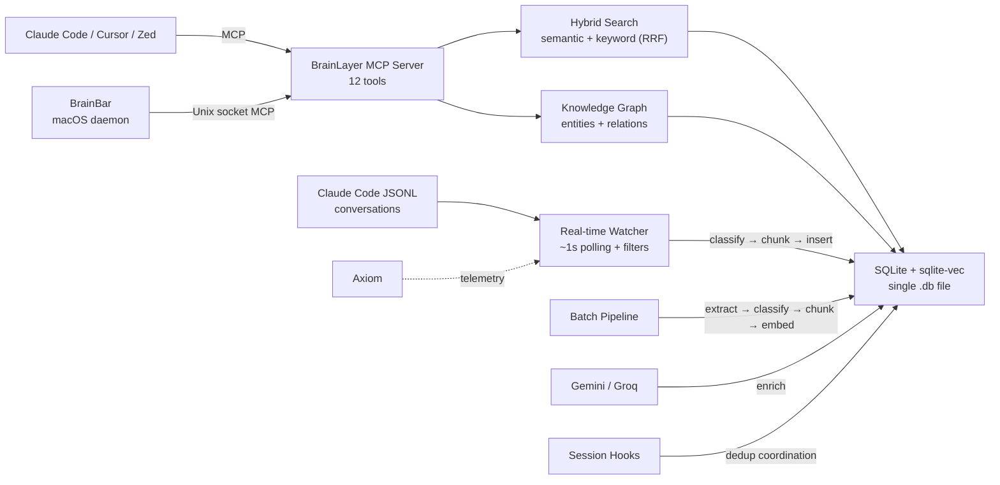

# BrainLayer

> Persistent memory and knowledge graph for AI agents — 12 MCP tools, real-time JSONL watcher, Axiom telemetry, and a native macOS daemon for always-on recall across every conversation.

[](https://pypi.org/project/brainlayer/)
[](https://github.com/EtanHey/brainlayer/actions/workflows/ci.yml)
[](LICENSE)
[](https://www.python.org/downloads/)
[](https://modelcontextprotocol.io)
[](#testing)
[](https://etanhey.github.io/brainlayer)
[](https://brainlayer.etanheyman.com)

---

**284,000+ chunks indexed** · **1,498 Python + 54 Swift tests** · **Real-time JSONL watcher** · **12 MCP tools** · **Axiom telemetry** · **BrainBar daemon (209KB)**

**Your AI agent forgets everything between sessions.** Every architecture decision, every debugging session, every preference you've expressed — gone. You repeat yourself constantly.

BrainLayer fixes this. It's a **local-first memory layer** that gives any MCP-compatible AI agent the ability to remember, think, and recall across conversations. Features a **real-time JSONL watcher** that indexes conversations within seconds, **chunk lifecycle management** (supersede, archive, search filtering), and **BrainBar** — a 209KB native macOS daemon for always-on memory access.

```
"What approach did I use for auth last month?"     →  brain_search
"Show me everything about this file's history"     →  brain_recall
"What was I working on yesterday?"                 →  brain_recall
"Remember this decision for later"                 →  brain_store
"Ingest this meeting transcript"                   →  brain_digest
"What do we know about this person?"               →  brain_get_person
"Look up the Domica project entity"                →  brain_entity
```

## Quick Start

```bash
pip install brainlayer
brainlayer init              # Interactive setup wizard
brainlayer index             # Index your Claude Code conversations
```

Then add to your editor's MCP config:

**Claude Code** (`~/.claude.json`):
```json
{
  "mcpServers": {
    "brainlayer": {
      "command": "brainlayer-mcp"
    }
  }
}
```

<details>
<summary>Other editors (Cursor, Zed, VS Code)</summary>

**Cursor** (MCP settings):
```json
{
  "mcpServers": {
    "brainlayer": {
      "command": "brainlayer-mcp"
    }
  }
}
```

**Zed** (`settings.json`):
```json
{
  "context_servers": {
    "brainlayer": {
      "command": { "path": "brainlayer-mcp" }
    }
  }
}
```

**VS Code** (`.vscode/mcp.json`):
```json
{
  "servers": {
    "brainlayer": {
      "command": "brainlayer-mcp"
    }
  }
}
```

</details>

That's it. Your agent now has persistent memory across every conversation.

## Architecture


```mermaid
graph LR
    A["Claude Code / Cursor / Zed"] -->|MCP| B["BrainLayer MCP Server<br/>12 tools"]
    B --> C["Hybrid Search<br/>semantic + keyword (RRF)"]
    C --> D["SQLite + sqlite-vec<br/>single .db file"]
    B --> KG["Knowledge Graph<br/>entities + relations"]
    KG --> D

    E["Claude Code JSONL<br/>conversations"] --> W["Real-time Watcher<br/>~1s polling + filters"]
    W -->|classify → chunk → insert| D
    F["Batch Pipeline"] -->|extract → classify → chunk → embed| D
    G["Gemini / Groq"] -->|enrich| D

    H["Session Hooks"] -->|dedup coordination| D
    I["BrainBar<br/>macOS daemon"] -->|Unix socket MCP| B
    J["Axiom"] -.->|telemetry| W
```

**Everything runs locally.** No cloud accounts required — Axiom telemetry and cloud enrichment are optional.

| Component | Implementation |
|-----------|---------------|
| Storage | SQLite + [sqlite-vec](https://github.com/asg017/sqlite-vec) (single `.db` file, WAL mode) |
| Embeddings | `bge-large-en-v1.5` via sentence-transformers (1024 dims, runs on CPU/MPS) |
| Search | Hybrid: vector similarity + FTS5 keyword, merged with Reciprocal Rank Fusion |
| Real-time watcher | Polls `~/.claude/projects/` JSONL files (~1s), 4-layer content filters, offset-persistent |
| Chunk lifecycle | Supersede, archive, search filtering — stale knowledge managed, not lost |
| Enrichment | Gemini / Groq cloud or local LLM (Ollama / MLX) — 10-field metadata per chunk |
| MCP Server | stdio-based, MCP SDK v1.26+, compatible with any MCP client |
| Telemetry | Axiom (`brainlayer-watcher` dataset) — flush metrics, errors, heartbeat, rewind detection |
| Session dedup | Hook coordination file prevents duplicate chunk injection across session lifecycle |
| Entity contracts | Typed entity schemas with health scoring, type hierarchy, and validation |
| BrainBar | Native macOS daemon (209KB Swift binary) — always-on MCP over Unix socket |

## MCP Tools (12)

### Core (4)

| Tool | Annotations | Description |
|------|-------------|-------------|
| `brain_search` | read-only, idempotent | Semantic search — unified search across query, file_path, chunk_id, filters. Lifecycle-aware. |
| `brain_store` | write | Persist memories — ideas, decisions, learnings, mistakes. Auto-type/auto-importance. Accepts `agent_id` for per-agent scoping. |
| `brain_recall` | read-only, idempotent | Proactive retrieval — current context, sessions, session summaries. |
| `brain_tags` | read-only, idempotent | Browse and filter by tag — discover what's in memory without a search query. |

### Knowledge Graph (5)

| Tool | Annotations | Description |
|------|-------------|-------------|
| `brain_digest` | write | Ingest raw content — entity extraction, relations, action items, or realtime LLM enrichment. |
| `brain_entity` | read-only, idempotent | Look up entities in the knowledge graph — type, relations, evidence. |
| `brain_expand` | read-only, idempotent | Expand a chunk_id with N surrounding chunks for full context. |
| `brain_update` | write, idempotent | Update, archive, or merge existing memories. |
| `brain_get_person` | read-only, idempotent | Person lookup — entity details, interactions, preferences (~200-500ms). |

### Enrichment (1)

| Tool | Annotations | Description |
|------|-------------|-------------|
| `brain_enrich` | write | Run LLM enrichment on chunks — Gemini, Groq, and MLX backends. |

### Lifecycle (2)

| Tool | Annotations | Description |
|------|-------------|-------------|
| `brain_supersede` | destructive | Mark old memory as replaced by new one. Safety gate: personal data requires explicit confirmation. |
| `brain_archive` | destructive | Soft-delete with timestamp. Excluded from default search, accessible via direct lookup. |

### Backward Compatibility

All 14 old `brainlayer_*` names still work as aliases.

## Enrichment

BrainLayer enriches each chunk with 10 structured metadata fields using a local LLM:

| Field | Example |
|-------|---------|
| `summary` | "Debugging Telegram bot message drops under load" |
| `tags` | "telegram, debugging, performance" |
| `importance` | 8 (architectural decision) vs 2 (directory listing) |
| `intent` | `debugging`, `designing`, `implementing`, `configuring`, `deciding`, `reviewing` |
| `primary_symbols` | "TelegramBot, handleMessage, grammy" |
| `resolved_query` | "How does the Telegram bot handle rate limiting?" |
| `epistemic_level` | `hypothesis`, `substantiated`, `validated` |
| `version_scope` | "grammy 1.32, Node 22" |
| `debt_impact` | `introduction`, `resolution`, `none` |
| `external_deps` | "grammy, Supabase, Railway" |

Four enrichment backends (override via `BRAINLAYER_ENRICH_BACKEND`):

| Backend | Best for | Speed |
|---------|----------|-------|
| **MLX** (local) | Default — runs on Apple Silicon, no API key | ~0.5-1s/chunk |
| **Groq** (cloud) | Fast cloud fallback | ~1-2s/chunk |
| **Gemini** (cloud) | Batch enrichment via `enrichment_controller.py` | ~0.6s/chunk |
| **Ollama** (local) | Alternative local backend | ~1-13s/chunk |

```bash
brainlayer enrich                              # Default backend
brainlayer watch                               # Real-time JSONL watcher (persistent)
```

## Why BrainLayer?

| | BrainLayer | Mem0 | Zep/Graphiti | Letta | LangChain Memory |
|---|:---:|:---:|:---:|:---:|:---:|
| **MCP native** | 12 tools | 1 server | 1 server | No | No |
| **Think / Recall** | Yes | No | No | No | No |
| **Chunk lifecycle** | Supersede/archive | Auto-dedup | No | No | No |
| **Real-time watcher** | ~1s JSONL polling | No | No | No | No |
| **Local-first** | SQLite | Cloud-first | Cloud-only | Docker+PG | Framework |
| **Zero infra** | `pip install` | API key | API key | Docker | Multiple deps |
| **Multi-source** | 7 sources | API only | API only | API only | API only |
| **Enrichment** | 10 fields | Basic | Temporal | Self-write | None |
| **Telemetry** | Axiom | No | No | No | No |
| **Open source** | Apache 2.0 | Apache 2.0 | Source-available | Apache 2.0 | MIT |

BrainLayer is the only memory layer that:
1. **Indexes in real-time** — JSONL watcher ingests conversations within seconds, not hours
2. **Manages knowledge lifecycle** — supersede stale facts, archive old decisions, search only current knowledge
3. **Runs on a single file** — no database servers, no Docker, no cloud accounts
4. **Works with every MCP client** — 12 tools, instant integration, zero SDK
5. **Knowledge graph** — entities, relations, and person lookup across all indexed data
6. **Entity contracts** — typed entity schemas with health scoring and type hierarchy for structured knowledge

## CLI Reference

```bash
brainlayer init               # Interactive setup wizard
brainlayer index              # Batch index conversations
brainlayer watch              # Real-time JSONL watcher (persistent, ~1s latency)
brainlayer search "query"     # Semantic + keyword search
brainlayer enrich             # Run LLM enrichment on new chunks
brainlayer enrich-sessions    # Session-level analysis (decisions, learnings)
brainlayer stats              # Database statistics
brainlayer brain-export       # Generate brain graph JSON
brainlayer export-obsidian    # Export to Obsidian vault
brainlayer dashboard          # Interactive TUI dashboard
```

## Configuration

All configuration is via environment variables:

| Variable | Default | Description |
|----------|---------|-------------|
| `BRAINLAYER_DB` | `~/.local/share/brainlayer/brainlayer.db` | Database file path |
| `BRAINLAYER_ENRICH_BACKEND` | auto-detect (MLX → Ollama → Groq) | Enrichment LLM backend (`mlx`, `ollama`, or `groq`) |
| `BRAINLAYER_ENRICH_MODEL` | `glm-4.7-flash` | Ollama model name |
| `BRAINLAYER_MLX_MODEL` | `mlx-community/Qwen2.5-Coder-14B-Instruct-4bit` | MLX model identifier |
| `BRAINLAYER_OLLAMA_URL` | `http://127.0.0.1:11434/api/generate` | Ollama API endpoint |
| `BRAINLAYER_MLX_URL` | `http://127.0.0.1:8080/v1/chat/completions` | MLX server endpoint |
| `BRAINLAYER_STALL_TIMEOUT` | `300` | Seconds before killing a stuck enrichment chunk |
| `BRAINLAYER_HEARTBEAT_INTERVAL` | `25` | Log progress every N chunks during enrichment |
| `BRAINLAYER_SANITIZE_EXTRA_NAMES` | (empty) | Comma-separated names to redact from indexed content |
| `BRAINLAYER_SANITIZE_USE_SPACY` | `true` | Use spaCy NER for PII detection |
| `GROQ_API_KEY` | (unset) | Groq API key for cloud enrichment backend |
| `BRAINLAYER_GROQ_URL` | `https://api.groq.com/openai/v1/chat/completions` | Groq API endpoint |
| `BRAINLAYER_GROQ_MODEL` | `llama-3.3-70b-versatile` | Groq model for enrichment |
| `AXIOM_TOKEN` | (unset) | Axiom API token for watcher telemetry (optional) |
| `BRAINLAYER_ENRICH_RATE` | `0.2` | Enrichment requests per second (0.2 = 12 RPM) |

## Optional Extras

```bash
pip install "brainlayer[brain]"     # Brain graph visualization (Leiden + UMAP) + FAISS
pip install "brainlayer[cloud]"     # Cloud backfill (Gemini Batch API)
pip install "brainlayer[youtube]"   # YouTube transcript indexing
pip install "brainlayer[ast]"       # AST-aware code chunking (tree-sitter)
pip install "brainlayer[kg]"        # GliNER entity extraction (209M params, EN+HE)
pip install "brainlayer[style]"     # ChromaDB vector store (alternative backend)
pip install "brainlayer[telemetry]" # Axiom observability (optional — degrades gracefully)
pip install "brainlayer[dev]"       # Development: pytest, ruff
```

## Data Sources

BrainLayer can index conversations from multiple sources:

| Source | Format | Indexer |
|--------|--------|---------|
| Claude Code | JSONL (`~/.claude/projects/`) | `brainlayer index` |
| Claude Desktop | JSON export | `brainlayer index --source desktop` |
| WhatsApp | Exported `.txt` chat | `brainlayer index --source whatsapp` |
| YouTube | Transcripts via yt-dlp | `brainlayer index --source youtube` |
| Codex CLI | JSONL (`~/.codex/sessions`) | `brainlayer ingest-codex` |
| Markdown | Any `.md` files | `brainlayer index --source markdown` |
| Manual | Via MCP tool | `brain_store` |
| Real-time | `brainlayer watch` LaunchAgent | JSONL watcher (~1s latency, 4-layer filters, checkpoint rewind detection) |

## Testing

```bash
pip install -e ".[dev]"
pytest tests/                           # Full suite (1,498 Python tests)
pytest tests/ -m "not integration"      # Unit tests only (fast)
ruff check src/                         # Linting
# BrainBar (Swift): 54 tests via Xcode
```

## Roadmap

See [docs/roadmap.md](docs/roadmap.md) for planned features including boot context loading, compact search, pinned memories, and MCP Registry listing.

## Contributing

Contributions welcome! See [CONTRIBUTING.md](CONTRIBUTING.md) for dev setup, testing, and PR guidelines.

## License

Apache 2.0 — see [LICENSE](LICENSE).

## Part of Golems

BrainLayer is part of the [Golems](https://etanheyman.com) MCP agent ecosystem:

- **[BrainLayer](https://brainlayer.etanheyman.com)** — Persistent memory (this repo)
- **[VoiceLayer](https://voicelayer.etanheyman.com)** — Voice I/O for AI agents
- **[cmuxLayer](https://cmuxlayer.etanheyman.com)** — Terminal orchestration for AI agents

Originally developed as "Zikaron" (Hebrew: memory). Extracted into a standalone project because **every developer deserves persistent AI memory**.
