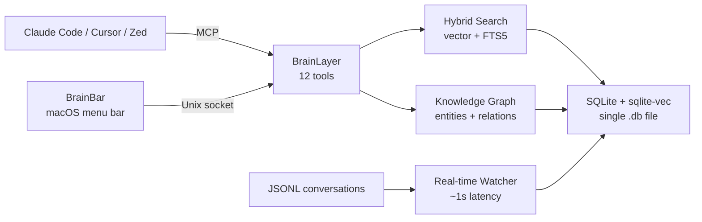

# BrainLayer

> Your AI has amnesia. BrainLayer fixes that.

[](https://pypi.org/project/brainlayer/)
[](https://github.com/EtanHey/brainlayer/actions/workflows/ci.yml)
[](LICENSE)
[](https://modelcontextprotocol.io)
[](#testing)
[](https://brainlayer.etanheyman.com)

Every architecture decision, every debugging session, every preference you've expressed — **gone between sessions.** You repeat yourself constantly. Your agent rediscovers bugs it already fixed.

BrainLayer gives any MCP-compatible AI agent persistent memory across conversations. One SQLite file. No cloud. No Docker. Just `pip install`.

```text
"What approach did I use for auth last month?"     →  brain_search
"Remember this decision for later"                 →  brain_store
"What was I working on yesterday?"                 →  brain_recall
"Ingest this meeting transcript"                   →  brain_digest
"What do we know about this person?"               →  brain_get_person
```

## Quick Start

```bash
pip install brainlayer
```

Add to your MCP config (`~/.claude.json` for Claude Code):

```json
{
  "mcpServers": {
    "brainlayer": {
      "command": "brainlayer-mcp"
    }
  }
}
```

That's it. Your agent now remembers everything.

<details>
<summary>Other editors (Cursor, Zed, VS Code)</summary>

**Cursor** (MCP settings):
```json
{
  "mcpServers": {
    "brainlayer": {
      "command": "brainlayer-mcp"
    }
  }
}
```

**Zed** (`settings.json`):
```json
{
  "context_servers": {
    "brainlayer": {
      "command": { "path": "brainlayer-mcp" }
    }
  }
}
```

**VS Code** (`.vscode/mcp.json`):
```json
{
  "servers": {
    "brainlayer": {
      "command": "brainlayer-mcp"
    }
  }
}
```

</details>

## MCP Tools (12)

Every tool includes [ToolAnnotations](https://modelcontextprotocol.io/specification/2025-03-26/server/tools#annotations) so agents know which calls are safe to run without confirmation.

| Tool | Type | What it does |
|------|------|-------------|
| `brain_search` | read | Semantic + keyword hybrid search across all memories. Lifecycle-aware. |
| `brain_store` | write | Persist decisions, learnings, mistakes. Auto-importance scoring. Per-agent scoping via `agent_id`. |
| `brain_recall` | read | Proactive retrieval — session context, summaries, recent work. |
| `brain_tags` | read | Browse tags and discover what's in memory without a query. |
| `brain_digest` | write | Ingest raw content — entity extraction, relations, action items. |
| `brain_entity` | read | Look up knowledge graph entities — type, relations, evidence. |
| `brain_expand` | read | Get a chunk with N surrounding chunks for full context. |
| `brain_update` | write | Update importance, tags, or archive existing memories. |
| `brain_get_person` | read | Person lookup — entity details, interactions, preferences. |
| `brain_enrich` | write | Run LLM enrichment — Gemini, Groq, or local MLX/Ollama. |
| `brain_supersede` | destructive | Replace old memory with new. Safety gate on personal data. |
| `brain_archive` | destructive | Soft-delete with timestamp. Recoverable via direct lookup. |

All 14 legacy `brainlayer_*` tool names still work as aliases.

## Architecture


```mermaid
graph LR
    A["Claude Code / Cursor / Zed"] -->|MCP| B["BrainLayer<br/>12 tools"]
    B --> C["Hybrid Search<br/>vector + FTS5"]
    C --> D["SQLite + sqlite-vec<br/>single .db file"]
    B --> KG["Knowledge Graph<br/>entities + relations"]
    KG --> D
    E["JSONL conversations"] --> W["Real-time Watcher<br/>~1s latency"]
    W --> D
    I["BrainBar<br/>macOS menu bar"] -->|Unix socket| B
```

**Everything runs locally.** Cloud enrichment (Gemini/Groq) and Axiom telemetry are optional.

| Layer | Implementation |
|-------|---------------|
| **Storage** | SQLite + [sqlite-vec](https://github.com/asg017/sqlite-vec), WAL mode, single `.db` file |
| **Embeddings** | `bge-large-en-v1.5` (1024 dims, CPU/MPS) |
| **Search** | Vector similarity + FTS5, merged with Reciprocal Rank Fusion |
| **Watcher** | Real-time JSONL indexing (~1s), 4-layer content filters, offset-persistent |
| **Enrichment** | 10 metadata fields per chunk — Groq, Gemini, MLX, or Ollama |
| **Knowledge Graph** | Entities, relations, co-occurrence extraction, person lookup |

## Why BrainLayer?

| | BrainLayer | Mem0 | Zep/Graphiti | Letta |
|---|:---:|:---:|:---:|:---:|
| **MCP tools** | 12 | 1 | 1 | 0 |
| **Local-first** | SQLite | Cloud-first | Cloud-only | Docker+PG |
| **Zero infra** | `pip install` | API key | API key | Docker |
| **Real-time indexing** | ~1s | No | No | No |
| **Knowledge lifecycle** | Supersede/archive | Auto-dedup | No | No |
| **Open source** | Apache 2.0 | Apache 2.0 | Source-available | Apache 2.0 |

## BrainBar — macOS Companion

Optional 209KB native Swift menu bar app. Quick capture (F4), live dashboard, knowledge graph viewer — all over a Unix socket. Auto-restarts after quit via LaunchAgent.

```bash
bash brain-bar/build-app.sh    # Build, sign, install LaunchAgent
```

Requires the BrainLayer MCP server.

## Data Sources

| Source | Indexer |
|--------|---------|
| Claude Code | `brainlayer index` (JSONL from `~/.claude/projects/`) |
| Claude Desktop | `brainlayer index --source desktop` |
| Codex CLI | `brainlayer ingest-codex` |
| WhatsApp | `brainlayer index --source whatsapp` |
| YouTube | `brainlayer index --source youtube` |
| Markdown | `brainlayer index --source markdown` |
| Manual | `brain_store` MCP tool |
| Real-time | `brainlayer watch` LaunchAgent (~1s, 4-layer filters) |

## Enrichment

Each chunk gets 10 structured metadata fields from a local or cloud LLM:

| Field | Example |
|-------|---------|
| `summary` | "Debugging Telegram bot message drops under load" |
| `tags` | "telegram, debugging, performance" |
| `importance` | 8 (architectural decision) vs 2 (directory listing) |
| `intent` | `debugging`, `designing`, `implementing`, `deciding` |
| `primary_symbols` | "TelegramBot, handleMessage, grammy" |
| `epistemic_level` | `hypothesis`, `substantiated`, `validated` |

```bash
brainlayer enrich                    # Run enrichment on new chunks
BRAINLAYER_ENRICH_BACKEND=groq brainlayer enrich   # Force Groq
```

## CLI Reference

```bash
brainlayer init               # Interactive setup wizard
brainlayer index              # Batch index conversations
brainlayer watch              # Real-time watcher (persistent, ~1s)
brainlayer search "query"     # Semantic + keyword search
brainlayer enrich             # LLM enrichment on new chunks
brainlayer stats              # Database statistics
brainlayer brain-export       # Brain graph JSON for visualization
brainlayer export-obsidian    # Export to Obsidian vault
brainlayer dashboard          # Interactive TUI
```

## Testing

```bash
pip install -e ".[dev]"
pytest tests/                           # 1,848 Python tests
pytest tests/ -m "not integration"      # Unit tests only (fast)
ruff check src/ && ruff format src/     # Lint + format
# BrainBar: 54 Swift tests via Xcode
```

<details>
<summary>Configuration (environment variables)</summary>

| Variable | Default | Description |
|----------|---------|-------------|
| `BRAINLAYER_DB` | `~/.local/share/brainlayer/brainlayer.db` | Database file path |
| `BRAINLAYER_ENRICH_BACKEND` | auto-detect | Enrichment backend (`groq`, `gemini`, `mlx`, `ollama`) |
| `GROQ_API_KEY` | (unset) | Groq API key for cloud enrichment |
| `AXIOM_TOKEN` | (unset) | Axiom telemetry token (optional) |
| `BRAINLAYER_ENRICH_RATE` | `5.0` | Requests per second (5.0 = 300 RPM, AI Pro supports 500+) |
| `BRAINLAYER_SANITIZE_EXTRA_NAMES` | (empty) | Names to redact from indexed content |

See [full configuration reference](https://etanhey.github.io/brainlayer/configuration/) for all options.

</details>

<details>
<summary>Optional extras</summary>

```bash
pip install "brainlayer[brain]"       # Brain graph visualization + FAISS
pip install "brainlayer[cloud]"       # Gemini Batch API enrichment
pip install "brainlayer[youtube]"     # YouTube transcript indexing
pip install "brainlayer[ast]"         # AST-aware code chunking (tree-sitter)
pip install "brainlayer[kg]"          # GliNER entity extraction (209M params)
pip install "brainlayer[telemetry]"   # Axiom observability
pip install "brainlayer[dev]"         # Development: pytest, ruff
```

</details>

## Contributing

Contributions welcome! See [CONTRIBUTING.md](CONTRIBUTING.md) for dev setup, testing, and PR guidelines.

## License

Apache 2.0 — see [LICENSE](LICENSE).

## Part of Golems

BrainLayer is part of the [Golems](https://etanheyman.com) MCP agent ecosystem:

- **[BrainLayer](https://brainlayer.etanheyman.com)** — Persistent memory (this repo)
- **[VoiceLayer](https://voicelayer.etanheyman.com)** — Voice I/O for AI agents
- **[cmuxLayer](https://cmuxlayer.etanheyman.com)** — Terminal orchestration for AI agents

Originally developed as "Zikaron" (Hebrew: memory). Extracted into a standalone project because **every developer deserves persistent AI memory**.
