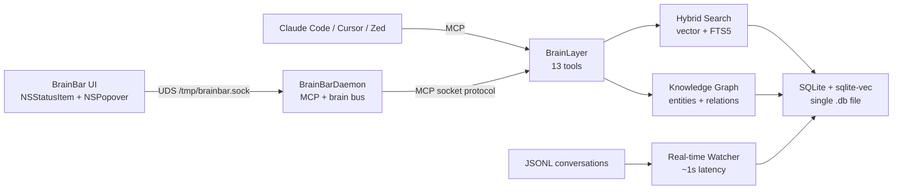
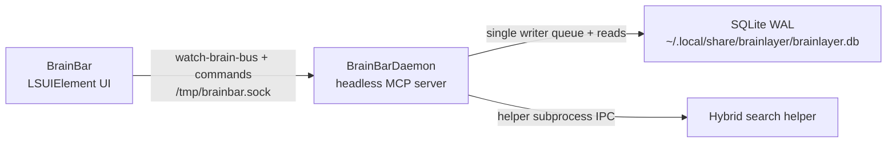

# BrainLayer

> Your AI has amnesia. BrainLayer fixes that.

[](https://pypi.org/project/brainlayer/)
[](https://github.com/EtanHey/brainlayer/actions/workflows/ci.yml)
[](LICENSE)
[](https://modelcontextprotocol.io)
[](#testing)
[](https://brainlayer.etanheyman.com)

Every architecture decision, every debugging session, every preference you've expressed — **gone between sessions.** You repeat yourself constantly. Your agent rediscovers bugs it already fixed.

BrainLayer gives any MCP-compatible AI agent persistent memory across conversations. One SQLite file. No cloud. No Docker. Just `pip install`.

```text
"What approach did I use for auth last month?"     →  brain_search
"Remember this decision for later"                 →  brain_store
"What was I working on yesterday?"                 →  brain_recall
"Ingest this meeting transcript"                   →  brain_digest
"What do we know about this person?"               →  brain_get_person
```

## Quick Start

```bash
pip install brainlayer
```

Add to your MCP config (`~/.claude.json` for Claude Code):

```json
{
  "mcpServers": {
    "brainlayer": {
      "command": "brainlayer-mcp"
    }
  }
}
```

That's it. Your agent now remembers everything.

<details>
<summary>Other editors (Cursor, Zed, VS Code)</summary>

**Cursor** (MCP settings):
```json
{
  "mcpServers": {
    "brainlayer": {
      "command": "brainlayer-mcp"
    }
  }
}
```

**Zed** (`settings.json`):
```json
{
  "context_servers": {
    "brainlayer": {
      "command": { "path": "brainlayer-mcp" }
    }
  }
}
```

**VS Code** (`.vscode/mcp.json`):
```json
{
  "servers": {
    "brainlayer": {
      "command": "brainlayer-mcp"
    }
  }
}
```

</details>

## MCP Tools (13)

Every tool includes [ToolAnnotations](https://modelcontextprotocol.io/specification/2025-03-26/server/tools#annotations) so agents know which calls are safe to run without confirmation.

| Tool | Type | What it does |
|------|------|-------------|
| `brain_search` | read | Semantic + keyword hybrid search across all memories. Lifecycle-aware. |
| `brain_store` | write | Persist decisions, learnings, mistakes. Auto-importance scoring. Per-agent scoping via `agent_id`. |
| `brain_recall` | read | Proactive retrieval — session context, summaries, recent work. |
| `brain_resume` | read | Recover recent PreCompact checkpoints for explicit session restoration. |
| `brain_tags` | read | Browse tags and discover what's in memory without a query. |
| `brain_digest` | write | Ingest raw content — entity extraction, relations, action items. |
| `brain_entity` | read | Look up knowledge graph entities — type, relations, evidence. |
| `brain_expand` | read | Get a chunk with N surrounding chunks for full context. |
| `brain_update` | write | Update importance, tags, or archive existing memories. |
| `brain_get_person` | read | Person lookup — entity details, interactions, preferences. |
| `brain_enrich` | write | Run LLM enrichment — Gemini, Groq, or local MLX/Ollama. |
| `brain_supersede` | destructive | Replace old memory with new. Safety gate on personal data. |
| `brain_archive` | destructive | Soft-delete with timestamp. Recoverable via direct lookup. |

All 14 legacy `brainlayer_*` tool names still work as aliases.

## Architecture


```mermaid
graph LR
    A["Claude Code / Cursor / Zed"] -->|MCP| B["BrainLayer<br/>13 tools"]
    B --> C["Hybrid Search<br/>vector + FTS5"]
    C --> D["SQLite + sqlite-vec<br/>single .db file"]
    B --> KG["Knowledge Graph<br/>entities + relations"]
    KG --> D
    E["JSONL conversations"] --> W["Real-time Watcher<br/>~1s latency"]
    W --> D
    I["BrainBar UI<br/>NSStatusItem + NSPopover"] -->|UDS /tmp/brainbar.sock| BB["BrainBarDaemon<br/>MCP + brain bus"]
    BB -->|MCP socket protocol| B
```

**Everything runs locally.** Cloud enrichment (Gemini/Groq) and Axiom telemetry are optional.

| Layer | Implementation |
|-------|---------------|
| **Storage** | SQLite + [sqlite-vec](https://github.com/asg017/sqlite-vec), WAL mode, single `.db` file |
| **Embeddings** | `bge-large-en-v1.5` (1024 dims, CPU/MPS) |
| **Search** | Vector similarity + FTS5, merged with Reciprocal Rank Fusion |
| **Watcher** | Real-time JSONL indexing (~1s), 4-layer content filters, offset-persistent |
| **Enrichment** | 10 metadata fields per chunk — Groq, Gemini, MLX, or Ollama |
| **Knowledge Graph** | Entities, relations, co-occurrence extraction, person lookup |

## Why BrainLayer?

| | BrainLayer | Mem0 | Zep/Graphiti | Letta |
|---|:---:|:---:|:---:|:---:|
| **MCP tools** | 13 | 1 | 1 | 0 |
| **Local-first** | SQLite | Cloud-first | Cloud-only | Docker+PG |
| **Zero infra** | `pip install` | API key | API key | Docker |
| **Real-time indexing** | ~1s | No | No | No |
| **Knowledge lifecycle** | Supersede/archive | Auto-dedup | No | No |
| **Open source** | Apache 2.0 | Apache 2.0 | Source-available | Apache 2.0 |

## BrainBar — macOS Companion

Optional native Swift menu bar companion split into two launchd-managed processes:


```mermaid
flowchart LR
    UI["BrainBar<br/>LSUIElement UI"] -->|"watch-brain-bus + commands<br/>/tmp/brainbar.sock"| D["BrainBarDaemon<br/>headless MCP server"]
    D -->|"single writer queue + reads"| DB["SQLite WAL<br/>~/.local/share/brainlayer/brainlayer.db"]
    D -->|"helper subprocess IPC"| H["Hybrid search helper"]
```

`BrainBarDaemon` owns the MCP server, `/tmp/brainbar.sock`, the single-writer path, the `watch-brain-bus` stream, and helper subprocess lifecycle. `BrainBar` owns only the `NSStatusItem`, transient `NSPopover`, SwiftUI surfaces, hotkey routing, and a reconnecting socket subscriber. Killing the UI does not stop the daemon socket.

```bash
bash brain-bar/build-app.sh    # Build, sign, install LaunchAgent
```

The build script builds both `BrainBar` and `BrainBarDaemon`, embeds both binaries in `BrainBar.app`, then installs `com.brainlayer.brainbar.plist` and `com.brainlayer.brainbar-daemon.plist` with `ProcessType=Interactive`. It refuses non-canonical checkouts and dirty trees by default ([#265](https://github.com/EtanHey/brainlayer/pull/265)) and stamps each bundle with `GitCommit`, `GitDescribe`, and `BuildTimeUTC` in `Info.plist` ([#264](https://github.com/EtanHey/brainlayer/pull/264)) so a stale install is diagnosable in seconds.

## Writer Arbitration

Background producers run with `BRAINLAYER_ARBITRATED=1` and append writes to `~/.brainlayer/queue/`; `com.brainlayer.drain.plist` drains that queue every 500ms as the single writer. Trigram FTS maintenance is explicit via `brainlayer repair-fts` and the weekly `com.brainlayer.repair-fts.plist`, not synchronous startup work. See [docs/arbitration.md](docs/arbitration.md).

## Recent Hardening (2026-04-15 → 2026-05-17)

Two-week stability sprint behind the next presentation. Every line below traces to a merged PR.

**Search recall & dedup**
- FTS recall hardened across Python, Swift BrainBar, and the watcher pipeline ([#263](https://github.com/EtanHey/brainlayer/pull/263)).
- Lexical defense dictionary exports for fragile-token recovery ([#262](https://github.com/EtanHey/brainlayer/pull/262)).
- MMR post-retrieval dedup on `brain_search` ([#242](https://github.com/EtanHey/brainlayer/pull/242)).
- Legacy unique `content_hash` index dropped — was blocking re-enrichment writes ([#245](https://github.com/EtanHey/brainlayer/pull/245)).
- Swift `brain_store` queue fallback so BrainBar can persist when the daemon is mid-restart ([#261](https://github.com/EtanHey/brainlayer/pull/261)).

**BrainBar reliability & UX**
- MenuBarExtra(.window) rewrite with live-state sparklines and full-width hero ([#248](https://github.com/EtanHey/brainlayer/pull/248)).
- Dashboard UX overhaul ([#246](https://github.com/EtanHey/brainlayer/pull/246)).
- MCP `initialize` handshake preserved under backpressure ([#247](https://github.com/EtanHey/brainlayer/pull/247)).
- KG force-sim early-exit + `onAppear` timer reset — kills CPU pegging when the graph tab is idle ([#249](https://github.com/EtanHey/brainlayer/pull/249)).

**Phase B preventive infra (2026-05-01)** — one canonical artifact per environment
- `/post-merge-deploy-check` skill + initial `canonical-deploy-registry.json` ([orchestrator#60](https://github.com/EtanHey/orchestrator/pull/60)) cross-checks GitHub merge metadata, the registry, and the deployed app's `Info.plist` so a merged PR cannot be declared shipped while the local bundle still points at the wrong build.
- Canonical app paths corrected in the deploy registry schema ([orchestrator#58](https://github.com/EtanHey/orchestrator/pull/58)).
- Build-stamp + canonical-build guards land together so future BrainBar bundles carry provenance and refuse silent worktree overwrites ([#264](https://github.com/EtanHey/brainlayer/pull/264), [#265](https://github.com/EtanHey/brainlayer/pull/265)).

**Test gates** — pre-push gate is mandatory before any push to `main`
- Pre-push regression gate ([#257](https://github.com/EtanHey/brainlayer/pull/257)) plus exit-0 fix on the success path ([#260](https://github.com/EtanHey/brainlayer/pull/260)).
- `scripts/run_tests.sh` orchestrator unifies Python + Swift + isolation test runs ([#256](https://github.com/EtanHey/brainlayer/pull/256)).
- Stale-index regression fixture ([#255](https://github.com/EtanHey/brainlayer/pull/255)) and Deepchecks regression harness ([#259](https://github.com/EtanHey/brainlayer/pull/259)).

**Security**
- All 11 Swift `MCPRouter` tools exposed via BrainBar now ship `ToolAnnotations` (cyberMaster H1) ([#253](https://github.com/EtanHey/brainlayer/pull/253)).

**In flight (2026-05-02 reliability sprint)** — [PR #251](https://github.com/EtanHey/brainlayer/pull/251)
- Restores the resizable dashboard panel via a floating `NSPanel` (`BrainBarDashboardPanelController`) instead of MenuBarExtra(.window).
- Adds trigram FTS5 (`chunks_fts_trigram`) with a startup-safety guard: synchronous backfill is skipped when the desynced trigram table exceeds 10K chunks, so BrainBar never blocks the live ~360K-chunk database before `/tmp/brainbar.sock` opens.
- KG atlas presentation (importance-based altitude filtering, region backdrops, deterministic seeding) and `AgentActivityMonitor` for live CLI presence on the dashboard.
- Pub/sub plane on `/tmp/brainbar.sock` is explicitly preserved (`brain_subscribe`, `brain_unsubscribe`, `notifications/claude/channel`) — only search/store handlers move to the Python MCP path.

**Phase 5 ship wave (2026-05-17)** — ingest hygiene + KG regression fix
- **Diagnostic + PreCompact noise rejection at ingest** ([#289](https://github.com/EtanHey/brainlayer/pull/289)) — `recursive_mcp_output_reason` now detects BrainLayer-MCP-unavailable diagnostics and PreCompact checkpoint payloads, rejecting them at the watcher / drain / store ingestion heads so tooling failures do not become durable memory. The hybrid reranker *demotes* (not removes) any chunk tagged with precompact/quarantine signals so explicit `include_checkpoints` callers still see them. Pre-push gate: `1995 passed, 9 skipped, 75 deselected, 1 xfailed`. A dry-run-first `scripts/quarantine_noise.py` is available for back-filling existing infra noise — live DB mutation requires explicit `--apply`.
- **Persist digest LLM entities** ([#290](https://github.com/EtanHey/brainlayer/pull/290)) — fixes a KG persistence regression where `brain_digest` silently skipped Gemini entity extraction because `process_chunk` passed `use_llm=llm_caller is not None` and the MCP/CLI path never sets `llm_caller`. Non-seed person entities were never materialized into `kg_entities` / `kg_entity_chunks`. The 2026-04-06 entity-recall recurrence root-caused to this code path. RED-first regression test (`test_digest_content_persists_llm_people_entities_for_lookup`) now guards the fix.
- **Enrichment LaunchAgent recovered** — `com.brainlayer.enrichment` was silently unloaded since 2026-05-15 11:50 IDT (no entity extraction running). Bootstrapped back on 2026-05-17 against the 56K-chunk backfill; throttled by Gemini 503s on flex tier but actively draining (verified via `launchctl list | grep enrichment` returning a live PID).

**June 2026 search & KG hardening** ([#433](https://github.com/EtanHey/brainlayer/pull/433)–[#445](https://github.com/EtanHey/brainlayer/pull/445))
- **Hook failures are now loud** ([#433](https://github.com/EtanHey/brainlayer/pull/433)) — BrainLayer hook DB failures raise clearly instead of silently swallowing errors.
- **Drain hardening** ([#435](https://github.com/EtanHey/brainlayer/pull/435)) — drain is now resilient to DB open locks under writer contention.
- **chunk_origin provenance** ([#436](https://github.com/EtanHey/brainlayer/pull/436)) — enrichment stamps `chunk_origin` on every processed chunk; a backfill pass covers existing unknowns, making provenance queryable across the full corpus.
- **MMR diversity is now on by default** ([#439](https://github.com/EtanHey/brainlayer/pull/439)) — `brain_search` applies Maximal Marginal Relevance post-retrieval dedup automatically; pass `mmr=false` to opt out.
- **KG entity dedup tooling** ([#441](https://github.com/EtanHey/brainlayer/pull/441)–[#443](https://github.com/EtanHey/brainlayer/pull/443)) — new path-detector and APSW-safe dedup suggestions for cleaning duplicate KG entities; slash-command reclassify collisions also resolved ([#444](https://github.com/EtanHey/brainlayer/pull/444)).
- **KG boost reconnected to entity FTS** ([#445](https://github.com/EtanHey/brainlayer/pull/445)) — entity-aware ranking is now wired end-to-end through the FTS path.

## Data Sources

| Source | Indexer |
|--------|---------|
| Claude Code | `brainlayer index` (JSONL from `~/.claude/projects/`) |
| Claude Desktop | `brainlayer index --source desktop` |
| Codex CLI | `brainlayer ingest-codex` |
| WhatsApp | `brainlayer index --source whatsapp` |
| YouTube | `brainlayer index --source youtube` |
| Markdown | `brainlayer index --source markdown` |
| Manual | `brain_store` MCP tool |
| Real-time | `brainlayer watch` LaunchAgent (~1s, 4-layer filters) |

## Enrichment

Each chunk gets 10 structured metadata fields from a local or cloud LLM:

| Field | Example |
|-------|---------|
| `summary` | "Debugging Telegram bot message drops under load" |
| `tags` | "telegram, debugging, performance" |
| `importance` | 8 (architectural decision) vs 2 (directory listing) |
| `intent` | `debugging`, `designing`, `implementing`, `deciding` |
| `primary_symbols` | "TelegramBot, handleMessage, grammy" |
| `epistemic_level` | `hypothesis`, `substantiated`, `validated` |

```bash
brainlayer enrich                    # Run enrichment on new chunks
BRAINLAYER_ENRICH_BACKEND=groq brainlayer enrich   # Force Groq
```

## CLI Reference

```bash
brainlayer init               # Interactive setup wizard
brainlayer index              # Batch index conversations
brainlayer watch              # Real-time watcher (persistent, ~1s)
brainlayer search "query"     # Semantic + keyword search
brainlayer enrich             # LLM enrichment on new chunks
brainlayer stats              # Database statistics
brainlayer brain-export       # Brain graph JSON for visualization
brainlayer export-obsidian    # Export to Obsidian vault
brainlayer dashboard          # Interactive TUI
```

## Testing

```bash
pip install -e ".[dev]"
git config core.hooksPath .githooks     # install repo pre-push hook once per clone
pytest tests/                           # 1,848 Python tests
pytest tests/ -m "not integration"      # Unit tests only (fast)
ruff check src/ && ruff format src/     # Lint + format
# BrainBar: 54 Swift tests via Xcode
```

<details>
<summary>Configuration (environment variables)</summary>

| Variable | Default | Description |
|----------|---------|-------------|
| `BRAINLAYER_DB` | `~/.local/share/brainlayer/brainlayer.db` | Database file path |
| `BRAINLAYER_ENRICH_BACKEND` | auto-detect | Enrichment backend (`groq`, `gemini`, `mlx`, `ollama`) |
| `GROQ_API_KEY` | (unset) | Groq API key for cloud enrichment |
| `AXIOM_TOKEN` | (unset) | Axiom telemetry token (optional) |
| `BRAINLAYER_ENRICH_RATE` | `5.0` | Requests per second (5.0 = 300 RPM, AI Pro supports 500+) |
| `BRAINLAYER_SANITIZE_EXTRA_NAMES` | (empty) | Names to redact from indexed content |

See [full configuration reference](https://etanhey.github.io/brainlayer/configuration/) for all options.

</details>

<details>
<summary>Optional extras</summary>

```bash
pip install "brainlayer[brain]"       # Brain graph visualization + FAISS
pip install "brainlayer[cloud]"       # Gemini Batch API enrichment
pip install "brainlayer[youtube]"     # YouTube transcript indexing
pip install "brainlayer[ast]"         # AST-aware code chunking (tree-sitter)
pip install "brainlayer[kg]"          # GliNER entity extraction (209M params)
pip install "brainlayer[telemetry]"   # Axiom observability
pip install "brainlayer[dev]"         # Development: pytest, ruff
```

</details>

## Contributing

Contributions welcome! See [CONTRIBUTING.md](CONTRIBUTING.md) for dev setup, testing, and PR guidelines.

## License

Apache 2.0 — see [LICENSE](LICENSE).

## Part of Golems

BrainLayer is part of the [Golems](https://etanheyman.com) MCP agent ecosystem:

- **[BrainLayer](https://brainlayer.etanheyman.com)** — Persistent memory (this repo)
- **[VoiceLayer](https://voicelayer.etanheyman.com)** — Voice I/O for AI agents
- **[cmuxLayer](https://cmuxlayer.etanheyman.com)** — Terminal orchestration for AI agents

Originally developed as "Zikaron" (Hebrew: memory). Extracted into a standalone project because **every developer deserves persistent AI memory**.
