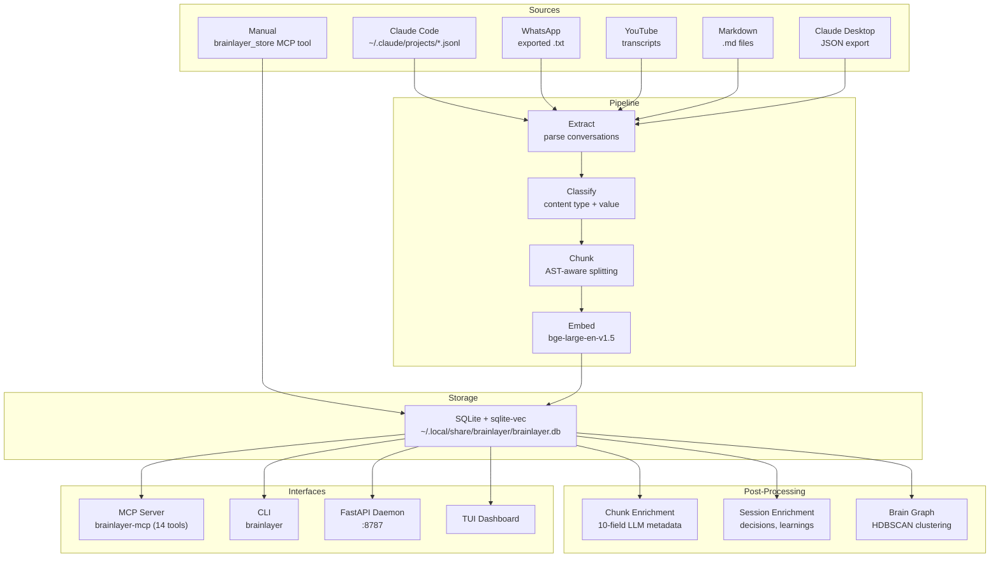

# Architecture

BrainLayer is a Python package with no external service dependencies. Everything runs locally.

## Overview



## Pipeline Stages

### Stage 1: Extract

Parses source files into individual messages with metadata.

- **Claude Code**: JSONL conversation files from `~/.claude/projects/`
- **Content-addressable storage**: System prompts are deduplicated via SHA-256 hash
- **Session detection**: Groups messages into sessions by ID and temporal proximity

### Stage 2: Classify

Each message is classified by content type and value:

| Type | Value | Action |
|------|-------|--------|
| `ai_code` | HIGH | Preserve verbatim |
| `stack_trace` | HIGH | Preserve exact (never split) |
| `user_message` | HIGH | Preserve |
| `assistant_text` | MEDIUM | Preserve |
| `file_read` | MEDIUM | Context-dependent |
| `git_diff` | MEDIUM | Extract changed entities |
| `build_log` | LOW | Summarize |
| `dir_listing` | LOW | Structure only |
| `noise` | SKIP | Filter out |

### Stage 3: Chunk

Splits content into indexable chunks (~500 tokens):

- **AST-aware chunking** with tree-sitter for code
- **Sentence-boundary splitting** for prose
- **Stack traces are never split**
- **10-20% overlap** between chunks for context continuity

### Stage 4: Embed

Generates vector embeddings:

- **Model**: `bge-large-en-v1.5` via sentence-transformers
- **Dimensions**: 1024
- **Acceleration**: MPS on Apple Silicon, CPU elsewhere
- **Load time**: ~8s (vs ~30s with Ollama embeddings)

### Stage 5: Index

Stores chunks with metadata in SQLite + sqlite-vec:

- **WAL mode** for concurrent reads
- **`busy_timeout = 5000ms`** for multi-process safety
- **Metadata**: project, content_type, source_file, char_count, created_at, source

## Search

BrainLayer uses hybrid search — combining semantic similarity with keyword matching.

### Semantic Search

Vector similarity search using sqlite-vec. The query is embedded with the same bge-large model, then matched against stored chunk embeddings.

### Keyword Search

FTS5 full-text search on chunk content. Catches exact matches that semantic search might miss (specific function names, error codes, etc.).

### Reciprocal Rank Fusion (RRF)

Both result sets are merged using RRF: `score = Σ 1/(k + rank_i)` where k=60. This produces better results than either search alone.

## Storage

Everything lives in a single SQLite database file:

```
~/.local/share/brainlayer/brainlayer.db  (~1.4GB for 260K+ chunks)
```

Key tables:

- **chunks** — content, embeddings, metadata, enrichment fields
- **chunks_vec** — sqlite-vec virtual table for vector search
- **chunks_fts** — FTS5 virtual table for keyword search
- **session_context** — session metadata (project, branch, plan)
- **session_enrichments** — session-level analysis results
- **prompts** — deduplicated system prompts (SHA-256 keyed)

## Concurrency

Multiple processes can safely access the database:

- **WAL mode** allows concurrent readers
- **busy_timeout = 5000ms** waits for write locks
- **Retry logic** with backoff on `SQLITE_BUSY`
- **Thread-local connections** in parallel enrichment workers
