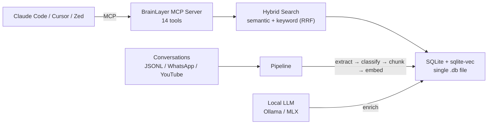

# BrainLayer

> Persistent memory for AI agents. Search, think, recall — across every conversation you've ever had.

**Your AI agent forgets everything between sessions.** Every architecture decision, every debugging session, every preference you've expressed — gone.

BrainLayer fixes this. It's a **local-first memory layer** that gives any MCP-compatible AI agent the ability to remember, think, and recall across conversations.

## Key Features

- **14 MCP tools** — think, recall, search, session analysis, file history, and more
- **Local-first** — SQLite + sqlite-vec, single file, no cloud, no Docker
- **Hybrid search** — semantic vectors + keyword, merged with Reciprocal Rank Fusion
- **10-field enrichment** — summary, tags, importance, intent, and more via local LLM
- **Multi-source** — Claude Code, WhatsApp, YouTube, Markdown, Claude Desktop, manual
- **Works everywhere** — Claude Code, Cursor, Zed, VS Code, any MCP client

## Quick Example

```bash
pip install brainlayer
brainlayer init              # Interactive setup wizard
brainlayer index             # Index your conversations
```

Add to Claude Code (`~/.claude.json`):
```json
{
  "mcpServers": {
    "brainlayer": {
      "command": "brainlayer-mcp"
    }
  }
}
```

Your agent now has persistent memory. Ask it:

- *"What approach did I use for auth last month?"* → `brainlayer_think`
- *"Show me everything about this file"* → `brainlayer_recall`
- *"What was I working on yesterday?"* → `brainlayer_current_context`
- *"Remember this for later"* → `brainlayer_store`

## Architecture Overview



## Next Steps

- [Quick Start](quickstart.md) — full setup guide
- [MCP Tools Reference](mcp-tools.md) — all 14 tools documented
- [Configuration](configuration.md) — environment variables and options
- [Architecture](architecture.md) — how it works under the hood
