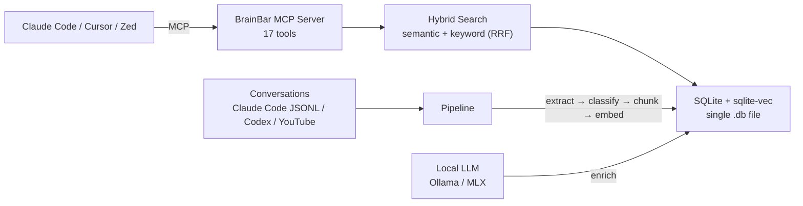

# BrainLayer

> Persistent memory for AI agents. Search, think, recall — across every conversation you've ever had.

**Your AI agent forgets everything between sessions.** Every architecture decision, every debugging session, every preference you've expressed — gone.

BrainLayer fixes this. It's a **local-first memory layer** that gives any MCP-compatible AI agent the ability to remember, think, and recall across conversations.

## Key Features

- **17 MCP tools** — served by BrainBar on `/tmp/brainbar.sock`; a session boots into a core palette of 5 (`brain_search`, `brain_store`, `brain_recall`, `brain_expand`, `expand_palette`) and `expand_palette` exposes the rest
- **Local-first** — SQLite + sqlite-vec, single file, no cloud, no Docker
- **Hybrid search** — semantic vectors + keyword, merged with Reciprocal Rank Fusion
- **15-field enrichment** — summary, key facts, tags, importance, intent, entities, sentiment, and more, via Groq/Gemini/MLX/Ollama
- **Multi-source** — Claude Code (batch + real-time watcher), Codex CLI, T3 threads, YouTube, manual
- **Works everywhere** — Claude Code, Cursor, Zed, VS Code, any MCP client

The 14 old `brainlayer_*` names are still handled by the Python library handlers under
`src/brainlayer/mcp/`, but BrainBar — the agent transport — does not serve them. Use `brain_*`.

## Quick Example

```bash
pip install brainlayer
brainlayer init              # Interactive setup wizard
brainlayer index             # Index your conversations
```

Add to Claude Code (`~/.claude.json`):
```json
{
  "mcpServers": {
    "brainlayer": {
      "command": "brainlayer-mcp-stdio-bridge"
    }
  }
}
```

BrainBar must be running and owning `/tmp/brainbar.sock`. The bridge ships with the package and
reconnects across BrainBar restarts. If you already have `socat`, the manual equivalent is
`{"command": "socat", "args": ["STDIO", "UNIX-CONNECT:/tmp/brainbar.sock"]}` — see
[MCP Config](mcp-config.md).

Your agent now has persistent memory. Ask it:

- *"What approach did I use for auth last month?"* → `brain_search`
- *"Open this result in full"* → `brain_expand`
- *"What was I working on yesterday?"* → `brain_recall`
- *"Remember this for later"* → `brain_store`

## Architecture Overview


```mermaid
graph LR
    A["Claude Code / Cursor / Zed"] -->|MCP| B["BrainBar MCP Server<br/>17 tools"]
    B --> C["Hybrid Search<br/>semantic + keyword (RRF)"]
    C --> D["SQLite + sqlite-vec<br/>single .db file"]

    E["Conversations<br/>Claude Code JSONL / Codex / YouTube"] --> F["Pipeline"]
    F -->|extract → classify → chunk → embed| D
    G["Local LLM<br/>Ollama / MLX"] -->|enrich| D
```

## Next Steps

- [Quick Start](quickstart.md) — full setup guide
- [MCP Tools Reference](mcp-tools.md) — the tool surface and the core palette
- [Configuration](configuration.md) — environment variables and options
- [Architecture](architecture.md) — how it works under the hood
